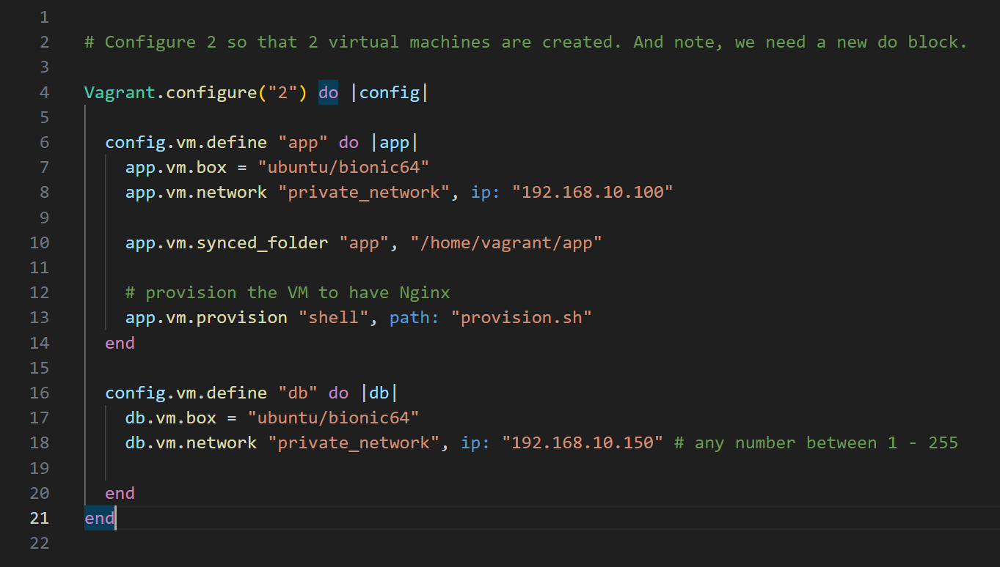
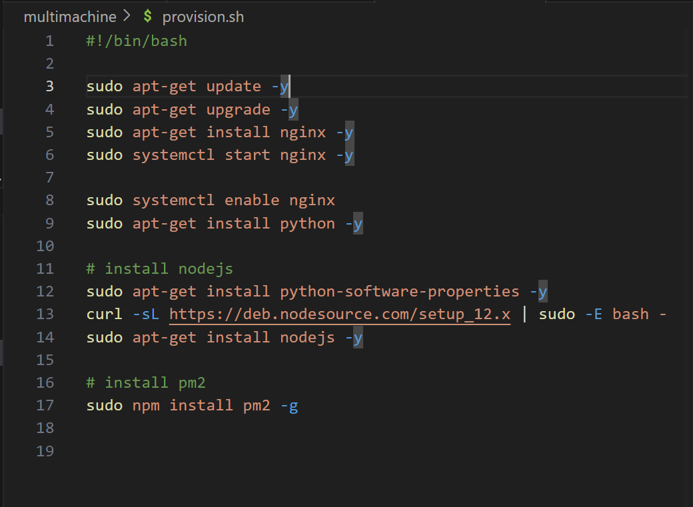
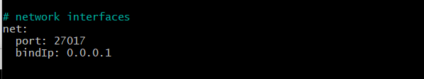
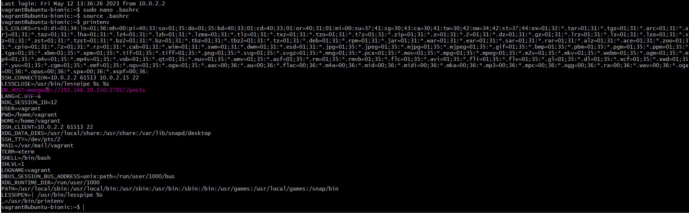

# Running two virtual machines and installing mongodb

First cd into the right directory and

`vagrant init`

to create a Vagrantfile

Make sure it looks like:

----

Create a provision.sh in the same folder and make sure it looks like:

----

Into the terminal, in the correct directory:

`vagrant up`

----

Open two Git Bash terminals and cd into the correct directory for both.

Then open one VM:
`vagrant ssh app`

And the other VM:
`vagrant ssh db`

----

In the db Bash terminal enter:

`sudo apt-get update -y`

`sudo apt-get upgrade -y`

----

To install mongo db enter:

`sudo apt-key adv --keyserver hkp://keyserver.ubuntu.com:80 --recv D68FA50FEA312927`

----

To set where we need to get mongodb from and get the key enter:

`echo "deb https://repo.mongodb.org/apt/ubuntu xenial/mongodb-org/3.2 multiverse" | sudo tee /etc/apt/sources.list.d/mongodb-org-3.2.list`

----

then update and upgrade:

`sudo apt-get update -y`

`sudo apt-get upgrade -y`

----

To install the specific version of mongo we need enter:

`sudo apt-get install -y mongodb-org=3.2.20 mongodb-org-server=3.2.20 mongodb-org-shell=3.2.20 mongodb-org-mongos=3.2.20 mongodb-org-tools=3.2.20`

----

To check the info on which version of Mongo:

`mongo --version`

----

To start mongo:

`sudo systemctl start mongod`

----

To enable (other ppl to connect to your db) and let there be multiple servers available:

`sudo systemctl enable mongod`

(can also mean it will keep running if things shut down.)

----

And finally:

`sudo systemctl status mongod`

to check the status.

----

In the db Bash terminal enter:
`sudo nano /etc/mongod.conf`

in `# network interfaces` change the bindIp from `127.0.0.0` to:

`0.0.0.0`

which lets anyone from any ip address enter.  This means low security though, be warned.

Should look like:

Then control + X to exit

save changes by entering `y`

----

then to restart:

`sudo systemctl restart mongod`

and to enable:

`sudo systemctl enable mongod`

----

Switch to the app VM terminal (or open a new Bash terminal if you haven't one already opened one.)

It's best not to hard code IP database into code because IP addresses can change.  In case you want to change it in the future or if you want your app running on multiple machines,instead of hardcoding, use a variable...

e.g.
`MY_VAR=hello`
`echo $MY_VAR` would print out `hello`
These variables are only accessible to the process that makes it though.  They are not global.

In order to make a global variable:
`export MY_VAR1=hello`
and this will be available everywhere.
`printenv MY_VAR1` after this would print `hello`

Variables allow us to connect apps to databases without hardcoding IP addresses.

Enter:
`printenv`
to see 

----

The problem with `export` is it won't save any information if we exit the VM.

We need to make the variables more permanent, so they stick around for next time we want them.

----

There is a hidden file in Linux called .bashrc where you can state your more permanent variables.

In the Home directory, enter:
`sudo nano .bashrc`

at the end of this file add:
`export DB_HOST=mongodb|://192.168.10.150:27017/posts`
This creates the environment variable called `DB_HOST` and sets it to the contents of mongodb followed by the ip address, the port, and page.

Save this. Then:
`source .bashrc`
will run it and put changes into affect.

`printenv`
to check...

Highlighted in pink, we can see our global variable:

----

`cd app`
and again, if it's in a nested directory:
`cd app`

then:
`npm install`

(This may take a while, so be patient!)

----

then

`node app.js`

----

If you run into problems:

`ps aux`

look for processes with nodejs.

`sudo kill -9 <pid>`

then try:
`node app.js`
again

----

Hopefully you should be able to go to the web browser and enter:

`192.168.10.150:27017/posts`

And the page should be working.